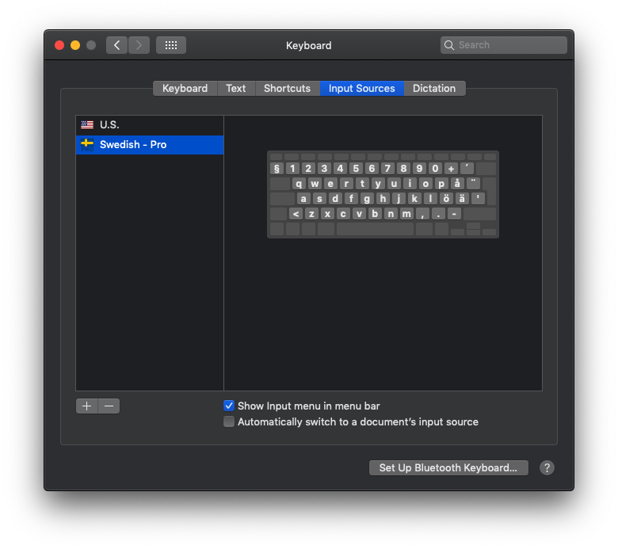
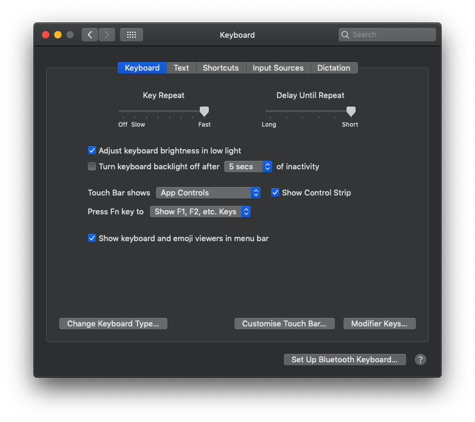
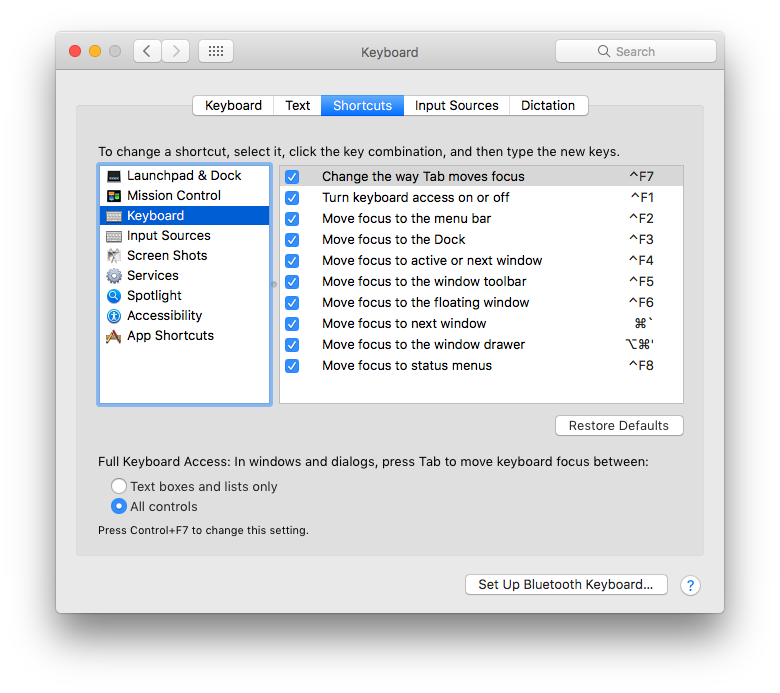
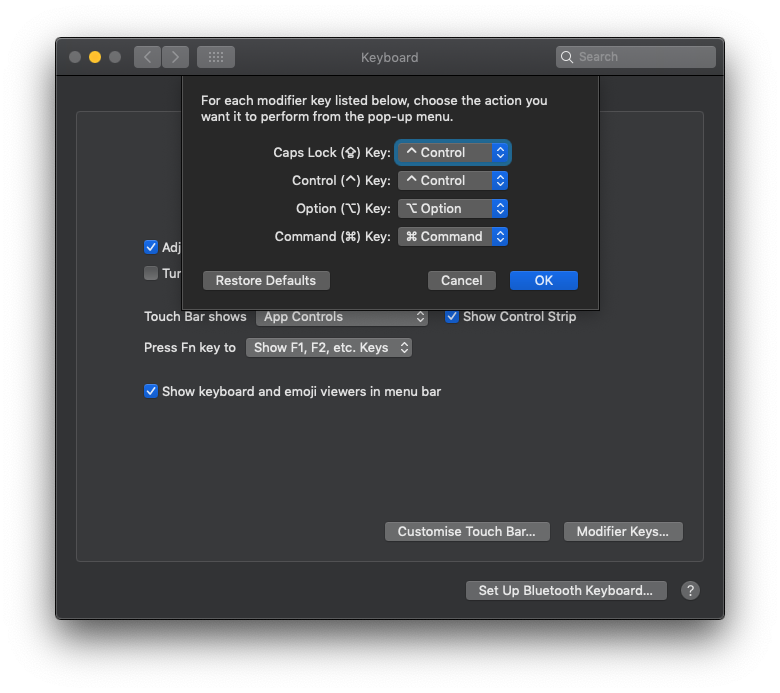

# Keyboard Setup

## 1. Input Sources

I spend most of my time on the american keyboard layout, but with a quick way to switch to swedish whenever I need it.

I've got the _Next Input Source_ currently mapped to <kbd>Shift</kbd><kbd>Ctrl</kbd><kbd>Alt</kbd><kbd>Cmd</kbd><kbd>Enter</kbd>.

And that is in turn programmed to <kbd>Fn</kbd><kbd>Enter</kbd> on my Pok3r. Stupid, yes. I should fix that.



## 2. Key Repeat

In order to have that quick and responsive key repeat you need to disable the built in "accent character popup" that appear as you hold a few of the letter keys.

```
defaults write -g ApplePressAndHoldEnabled -bool false
```

You need to either logout or restart the computer for this to take effect in the whole system.

On top of that, make sure to increase the frequency and initial delay for the repeating:



## 3. Full keyboard access in windows and dialogs



## Disable accent characters menu

```
defaults write -g ApplePressAndHoldEnabled -bool false
```

## Turn Caps Lock into Ctrl


