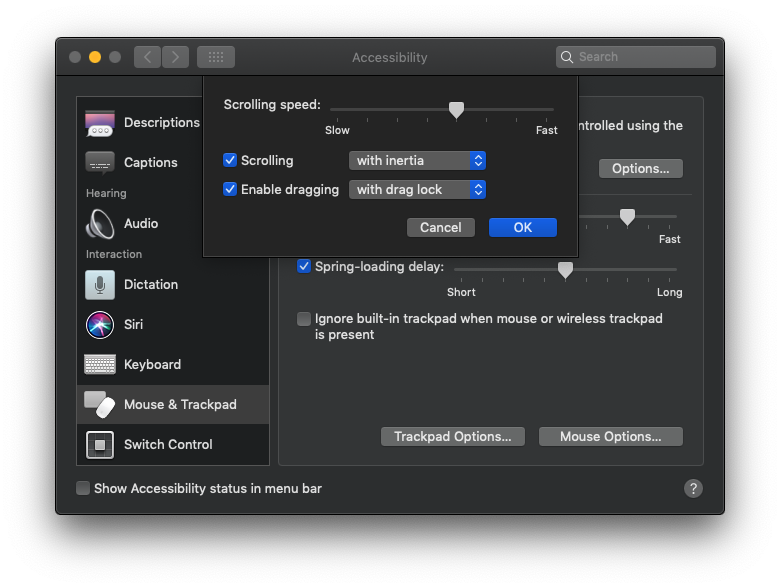
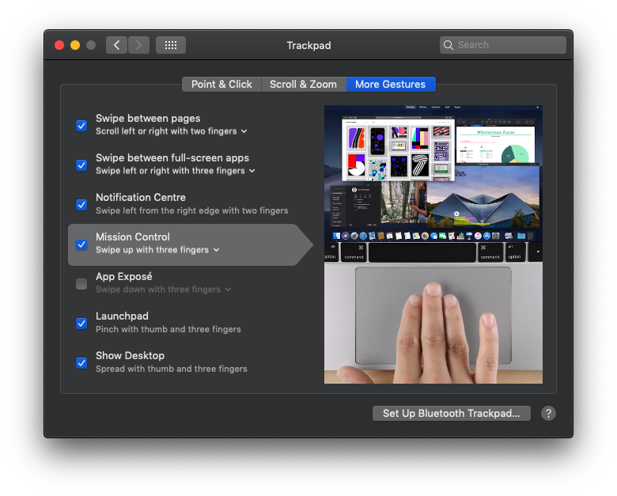
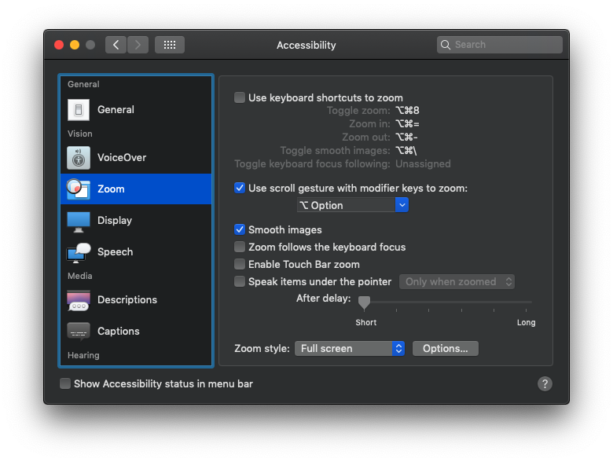

# Mouse and Trackpad

## 1. Tapping drag-lock

Not everyone likes this, but I have a really hard time using the trackpad without.

Start dragging _something_ by double-tapping it. The dragging is now "locked" until your next tap. You can let go of the trackpad, and still have the dragging continue. Try it, it's kind of hard to explain.

## 2. Other Gestures

I use _Mission Control_ a lot. I've gotten used to have it on a three finger swipe up.

## 3. Screen Zoom

I use the built-in _screen zoom_ functionality from time to time. Right now it's on <kbd>Alt</kbd> + Scroll

